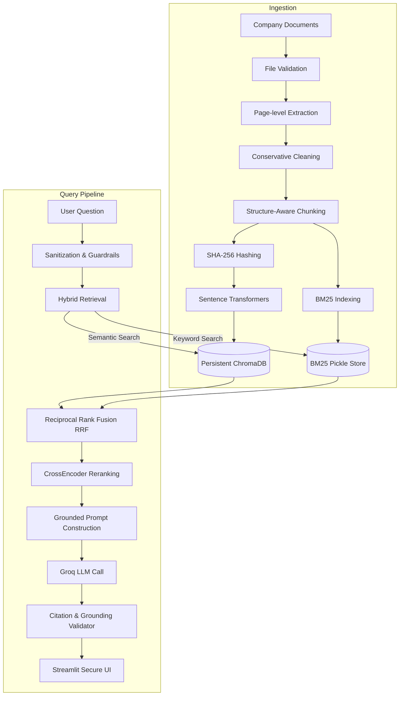

# 🩺 Document Intelligence Chatbot for Healthcare & Wellness

A professional, enterprise-ready Retrieval-Augmented Generation (RAG) assistant designed for healthcare and wellness companies. The chatbot allows HR representatives and authorized personnel to query internal benefits, screening guidelines, and wellness policies in natural language, generating grounded answers with verified citations and strict privacy compliance.

> [!IMPORTANT]
> **Privacy Notice:** The original company documents are not included in this repository. They remain in a locally ignored directory and are excluded from version control.

---

## 1. System Architecture

Below is the conceptual architecture of the grounded ingestion, hybrid retrieval, and validation pipeline:



---

## 2. Key Features

- **Strict Document-Only Policy:** Ensures the model does not answer questions from internal knowledge or fabricate answers. 
- **Hybrid Retrieval Pipeline:** Combines ChromaDB semantic similarity with BM25 keyword matching for exact numerical values, policy names, and abbreviations.
- **Reranking:** Prunes and optimizes candidate passages using a local `CrossEncoder` model (`cross-encoder/ms-marco-MiniLM-L-6-v2`).
- **Citation Validation:** Independently verifies that all citations and quotes returned by the LLM match the ingested document chunks character-for-character before showing them to the user.
- **Robust Guardrails:** Prevents prompt-injection attempts, configuration overrides, and refuses clinical medical diagnosis or medication prescription requests.

---

## 3. Technology Stack

- **Framework:** Streamlit (UI & State Management)
- **Model Orchestration:** Groq Python SDK (llama-3.1-70b-versatile)
- **Vector Database:** ChromaDB (Local Persistent Mode)
- **Local Embeddings:** Sentence Transformers (`BAAI/bge-small-en-v1.5`)
- **Document Parsers:** PyMuPDF (PDF), python-docx (DOCX), python-pptx (PPTX)
- **Keyword Matcher:** Rank-BM25
- **Reranker:** Sentence Transformers CrossEncoder
- **Verification & Configuration:** Pydantic V2, pydantic-settings, dotenv, Pytest

---

## 4. Directory Structure

```text
wellness-document-rag-chatbot/
│
├── app.py                      # Main Streamlit UI
├── ingest.py                   # Ingestion Pipeline Script
├── evaluate.py                 # Grounded RAG Evaluation Script
├── requirements.txt            # Python dependencies
├── .env.example                # Sample environment configuration
├── .gitignore                  # Git exclusion rules
├── pyproject.toml              # Tool settings (pytest, black, ruff)
├── Dockerfile                  # Container definition
│
├── config/
│   └── settings.py             # Strongly typed Pydantic settings
│
├── src/
│   ├── models/schemas.py       # Pydantic schemas (Citations, Responses)
│   ├── loaders/                # File parsers (PDF, DOCX, PPTX, TXT)
│   ├── preprocessing/          # Cleaner & Structure-Aware Chunker
│   ├── indexing/               # Embeddings, ChromaDB, & BM25 stores
│   ├── retrieval/              # Hybrid Retriever & Reranking
│   ├── generation/             # Groq Client, Prompts, & Citation Validator
│   ├── safety/                 # Query Guardrails & Sanitizers
│   └── utils/                  # Exception definitions & hashing
│
├── data/
│   ├── documents/              # Production documents (locally ignored)
│   ├── sample_documents/       # Fictional demonstration documents
│   ├── processed/              # Persistent BM25 Pickle storage
│   └── chroma_db/              # Persistent Chroma database
│
└── tests/                      # Component tests (pytest)
```

---

## 5. Local Installation & Setup

### Prerequisites
- Python 3.11
- A valid Groq API Key

### Windows Setup Instructions

1. **Clone the repository:**
   ```cmd
   git clone <repository_url>
   cd wellness-document-rag-chatbot
   ```

2. **Create and activate a virtual environment:**
   ```cmd
   python -m venv .venv
   .venv\Scripts\activate
   ```

3. **Install dependencies:**
   ```cmd
   pip install -r requirements.txt
   ```

4. **Setup environment variables:**
   ```cmd
   copy .env.example .env
   ```
   Open the `.env` file and replace `your_groq_api_key_here` with your actual Groq API key:
   ```env
   GROQ_API_KEY=gsk_YourActualKeyHere...
   ```

---

## 6. Running Ingestion

### A. Demonstration / Sample Mode (Recommended)
This runs the pipeline on fictional test documents containing wellness, mental health, and health screening mock policies:
```cmd
python ingest.py --sample
```

### B. Production Mode
Place your 15 confidential company documents inside the `data/documents/` folder. Then execute:
```cmd
python ingest.py
```

---

## 7. Running the Application

Start the Streamlit application interface:
```cmd
streamlit run app.py
```
Open [http://localhost:8501](http://localhost:8501) in your browser.

---

## 8. Testing & Evaluation

### Running Component Tests
Verify loaders, chunkers, retrieval, guardrails, and citation check components:
```cmd
python -m pytest
```

### Running Evaluation Pipeline
Analyze retrieval hit rate, MRR, latency, safety classifications, and accuracy metrics:
```cmd
python evaluate.py --sample
```

---

## 9. Security & Healthcare Disclaimer

### Security Guardrails
- **Prompt Injection Defense:** Input parser checks for instructions override attempts and system prompt extraction queries.
- **Untrusted Context Processing:** Document content is processed strictly as reference material. Instructions found in documents are ignored.
- **Key Safety:** API keys are never exposed in standard logs or UI pages.

### Healthcare Disclaimer
This assistant retrieves information from the supplied company documents. It does not provide independent medical diagnosis, emergency guidance, medication advice, or personalized treatment. Please consult a qualified healthcare professional.

---

## 10. Author Info

**Nishant Sharma**  
*AI and Data Science Developer*  
GitHub: [NishantSharma2004](https://github.com/NishantSharma2004)
